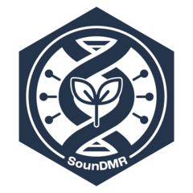

# sounDMR 
For more information on the package, as well as examples of the types of downstream analyses that can be run using these results see Colicchio et al., 2023, [Scientific Reports](https://www.nature.com/articles/s41598-023-38356-7)

The following document contains a walkthrough of how to get ONT data into the appropriate format to run through sounDMR and a simple tutorial of the functions used to run a differential methylation analysis using sounDMR.

Note: Do not use the contents of the Docker. This is for Whole genome methylation analysis and is still in its beta stage. We are currently building a robust code to handle large data and will be releasing the full version soon.  


## Pre-requisites
We need to run Megalodon/Deep-Signal Plant/Bonito/Dorado to calculate methylation levels at each cytosine for each individual. This package technically works with any ONT bed file with a format as mentioned in [here](https://www.encodeproject.org/data-standards/wgbs/), in the **Description of bedMethyl file section**. If focusing on a small part fo the genome, these bed files must be subset using `bedtools intersect` to focus on specific regions of the genome.

```
bedtools intersect -a [ONT_methyl.bed] -b [target_regions.bed] -wa > [ONT_methyl_subset.bed]
```
More information on bedtools intersect can be found [here](https://bedtools.readthedocs.io/en/latest/content/tools/intersect.html).

In addition, these files must constain the cytosine contexts in the last column. This can be achieved using [modbam2bed](https://github.com/epi2me-labs/modbam2bed) for older hardware to split the bed file based on cytosine context. A simple `awk` command can then be used to add the cytosine context into an additional column before recombining into a single file. Alternatively this can be achieved with [modkit](https://github.com/nanoporetech/modkit) with the following line to convert into the proper format:
`cat ${unconverted_bed} | awk -v OFS='\t' '{print $1, $2, $3, $4, $5, $6, $7, $8 ,$9, $10, $11, $4 }' |  sed 's/m,//g' |  sed 's/,0//g' > ${output_bed}`

## Installation
Make sure you have access to the latest version of the package and go through the installation steps
below. This can be done either by downloading the `tar.gz` file from
[github](https://github.com/SoundAg/sounDMR) or by cloning the project and moving to your local
environment or by installing directly from github via devtools. This only needs to be done once.

``` r
# Install directly from github
install.packages("devtools")
library(devtools)
install_github("SoundAg/sounDMR")
```

## Usage
`library(sounDMR)` will load the core packages:

- [tidyverse](https://tidyverse.org)
- [reshape2](https://www.rdocumentation.org/packages/reshape2/versions/1.4.4)
- [changepoint](https://cran.r-project.org/web/packages/changepoint/changepoint.pdf)
- [lme4](https://cran.r-project.org/web/packages/lme4/lme4.pdf)
- [Formula](https://www.rdocumentation.org/packages/stats/versions/3.6.2/topics/formula)
- [glmmTMB](https://cran.r-project.org/web/packages/glmmTMB/glmmTMB.pdf)

``` r
library(sounDMR)

#>Loading required package: changepoint
#>Loading required package: zoo
#>
#>Attaching package: ‘zoo’
#>
#>The following objects are masked from ‘package:base’:
#>
#>    as.Date, as.Date.numeric
#>
#>Successfully loaded changepoint package version 2.2.4
#> See NEWS for details of changes.
#>Loading required package: Formula
#>Loading required package: lme4
#>Loading required package: Matrix
#>Loading required package: reshape2
#>Loading required package: tidyverse
#>── Attaching packages ────────────────────────────────────────── tidyverse 1.3.2 ──
#>✔ ggplot2 3.4.0      ✔ purrr   0.3.5
#>✔ tibble  3.1.8      ✔ dplyr   1.0.10
#>✔ tidyr   1.2.1      ✔ stringr 1.4.1
#>✔ readr   2.1.3      ✔ forcats 0.5.2
#>── Conflicts ───────────────────────────────────────────── tidyverse_conflicts() ──
#>✖ tidyr::expand() masks Matrix::expand()
#>✖ dplyr::filter() masks stats::filter()
#>✖ dplyr::lag()    masks stats::lag()
#>✖ tidyr::pack()   masks Matrix::pack()
#>✖ tidyr::unpack() masks Matrix::unpack()
#>Loading required package: glmmTMB

```

## Data availability
Sample data is available on the [github](https://github.com/SoundAg/sounDMR) page which includes methyl bed files for 2 treated and control individuals each along with Experimental design file (file containing the experimental matrix data) and Gene coordinates file for the ZoomFrame.


## Workflow
This package follows the general workflow found in the *DMR_analysis_workflow.R* script. It follows the framework outline below:

#### Create Methylframe
The first step is to generate Methylframe. This function calls 2 functions to generate megaframe and generate zoomframe depending on the type of analysis. Examples for both are provided in the Readme. Megaframe is a dataframe that includes combined methyl.bed information from all the samples in the analysis.Zoomframe is a version of the megaframe that includes additional columns like,
gene name or gene ID : There is flexibility to choose what column should be included in the dataframe using the Gene_column parameter, make sure to provide the exact same name;
Zeroth_pos : Position adjusted to have position 0 as ATG for the speicifc gene;
Gene : This can inclkude either Gene Id or Gene names for tracking during DMR analysis;
Zoom_co : This keeps track of whether the given position is within the gene or is an adaptive region.

```
# Find the Bedmethyl files within the working directory
methyl_bed <- list.files(path=".",pattern="*.bed")

```
##### Whole genome bedmethyl processing
For whole genome bed files, additional steps are necessary to ensure data is in the right format and that it is subset by chromsomes
to make sure that R doesn't run out of memory. 

```
#Split the large bed file by chromosomes
bedlist <- c()
for (i in 1:length(methyl_bed)) {
  beds <- split_by_chromosome(methyl_bed[i])
  bedlist[(length(bedlist) + 1)] <- list(beds)
}

#get the list of chromosome names to automatically used to grep the respective bedfiles
#or you can manually add a list of chromosomes chr_list <- c()
chrs_list <- unique(str_extract(bedlist,"ch0"))


#extract bedfile names based on the chromosome list.
#Note: For whole genome bed files, You can choose 1 at a time to avoid running out of memory
#update chrs_list[1] for the chromosome of interest
methyl_bed <- bedlist[grep(chrs_list[1],bedlist)]

```

Zoomframe is only created if and when the Geneco file is provided. Geneco file should include the following columns at the bare minimum :
Gene_Name | Chromosome | Low | High | Gene_length | Strand | Adapt_Low | Adapt_High .
Low and High refer to gene body coordinates in the 5'to 3' direction and Adapt_Low and Adapt_High refers to the coordinates for adaptive region around the gene. The previous step can be skipped in this case. 

```
# Import the Geneco file
Geneco <- read.table(file.choose(), header=TRUE, sep=",")


# create methylframe
#without gene info
Methylframe <- generate_methylframe(methyl_bed_list=methyl_bed, Sample_count = 0,
                                  Methyl_call_type="Dorado", filter_NAs = 0,
                                  gene_info = FALSE, gene_coordinate_file = NA, Gene_column=NA,
                                  target_info=FALSE,
                                  File_prefix="Sample")


#with gene info
Methylframe <- generate_methylframe(methyl_bed_list=All_methyl_beds, Sample_count = 0,
                                  Methyl_call_type="Dorado", filter_NAs = 0,
                                  gene_info = TRUE, gene_coordinate_file = Geneco, Gene_column='Gene_Name',
                                  target_info=TRUE,
                                  File_prefix="Sample")
```
Note: This function also saves an experimental design starter which would require you to include all the details before the analysis, along with megaframe and zoomframe(if gene_info=TRUE) in the current working directory.

#### Clean and Rearrange Data
This step cleans the data read into the environment and creates "long" formats
of the count of methylated and unmethylated reads as well as the percent
methylation for each individual.

```
experimental_design_df <- read.table(file.choose(), header=TRUE, sep=",")
dmr_obj <- create_dmr_obj(Methylframe, experimental_design_df)
```

#### Creating Methylation Summary Data
This section is involved in manipulating the methylation data to summarize
information based on specific variables such as the Percent methylation of each
individual for each cytosine. It also creates three columns for each individual:
the Z score, the change in methylation between the treatment and the control, and
the read depth for an individual. There is an optional `additional_summary_cols`
parameter that will allow us to include additional columns given a summary
statistic function such as `mean`, `sd`, or `var` and the name of the column on
which to run the summary statistics. Multiple tuples can be added into this
list to create additional summary columns. Note: the function name must be
a string.

```
methyl_summary <- create_methyl_summary(dmr_obj, control = 'C', treated = 'T',
                                        additional_summary_cols = list(c('sd', 'Group')))

# Option to subset methyl_summary
individuals_of_interest = unique(dmr_obj$experimental_design_df$Individual)
methyl_summary <- subset_methyl_summary(methyl_summary,
                                        individuals_to_keep = individuals_of_interest)
```

#### DMR Analysis
This section is where the model is run for our DMR analysis. We recommend using a
binomial model when comparing groups (e.g. control vs treated) and a beta-binomial
model when comparing individuals vs the control group. The user has the option to change the fixed
and random effects passed into the model depending on the goals of the experiment.

```
# Group Model
methyl_summary <- find_DMR(methyl_summary, dmr_obj, fixed = c('Group'),
                           random = c('Individual'), reads_threshold = 3,
                           control = 'C', model = 'binomial',
                           analysis_type = 'group')

# Individual Model
methyl_summary <- find_DMR(methyl_summary, dmr_obj, fixed = c('Group'),
                           random = c('Individual'), reads_threshold = 5,
                           control = 'C', model = 'beta-binomial',
                           analysis_type = 'individual')
```

#### Changepoint Analysis
The output from the previous step gets passed into our changepoint analysis
section. Here the user picks a column upon which to run the analysis. We
recommend using one of the Z_score columns created from the fixed effects provided
to the model.

```
# The genes of interest for the experiment
target_genes <- unique(dmr_obj$ZoomFrame_filtered$Gene)

methyl_summary_cg <- changepoint_analysis(methyl_summary, CG_penalty = 9,
                                       CHG_penalty = 4, CHH_penalty = 7,
                                       target_genes = target_genes,
                                       save_plots = F,
                                       z_col = "Z_GroupT_small")
```

#### Sound score
This function takes in the data from the previous step that includes changepoint regions based on a specific test statistic of interest and then creates an aggregated changepoint region file that includes summary statistics for each region. A "sound score" is then computed to get a measure of the strength of a Differentially Methylated Region(DMR) within that region. The two Soundscores produced by default are the dmr_score, and dmr_score2.  These are as follows:

```
dmr_score<-(((Count)^(1/3))*(abs(MethRegion_Z)*abs(RegionStatsPer_Change))^(1/2))

dmr_score2<-((Count)^(1/3))*(abs(MethRegion_Z)*abs(asin(sqrt(Per_Change/100+Control/100))-asin(sqrt(Control/100)))^(1/2))
```

Additionally, there is an option for the user to specify their own custom founction to use for a DMR_score:

This can be entered as:

UserFunction=(Ag_Groups$Count)^(1/3))

Note, that this function takes columns present in methylsummary file, and should be called with "Ag_Groups".

Additionally, this function  will produce a plot showing the distribution of dmrscores relative to the percentile.

```
DMR_score <- sound_score(changepoint_OF = methyl_summary_cg,
                         Statistic = changepoint_cols[1],
                         Per_Change = "Treat_V_Control", CF = F,
                         other_columns=c("Control", "Estimate_GroupT_small"),
                         UserFunction = NA)
```
#### Boot score
Note: This function was designed to test an a priori hypothesis about what area of the genome might show differential methylation.  The user can enter in this target region, and the bootscore compares differential methylation around that region with other areas in the genome.

This function takes in the data from the sound_score function, the gene of interest, and the region of interest around it relative to the ATG (start and stop).
Regions that are >10kb away from the target are given a score of 0 by default. The function also computes a bootstrap p-value to provide a statistical basis for the score.

```
# Only run bootscore if gene info is available
DMR_boot_score <- boot_score(sound_score_obj = DMR_score,
                             target_gene = "AT1G01640", scoring_col_name="dmr_score2")
```
